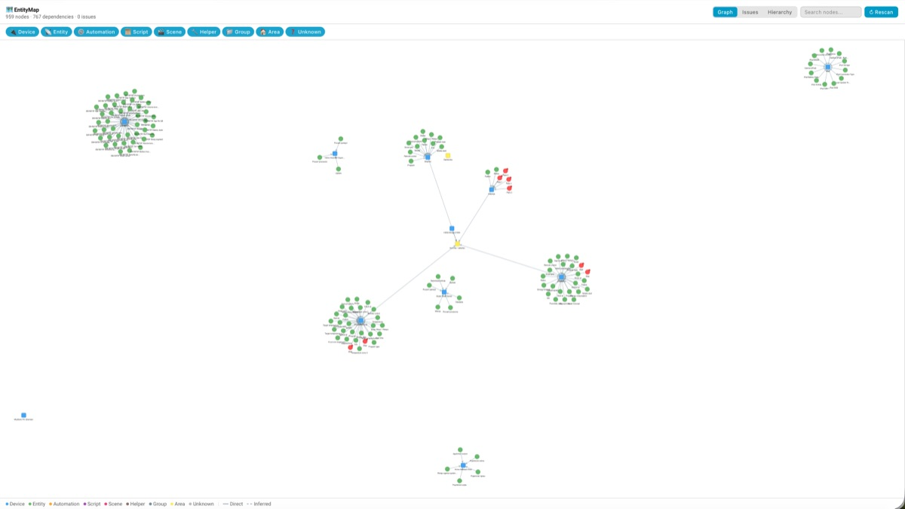
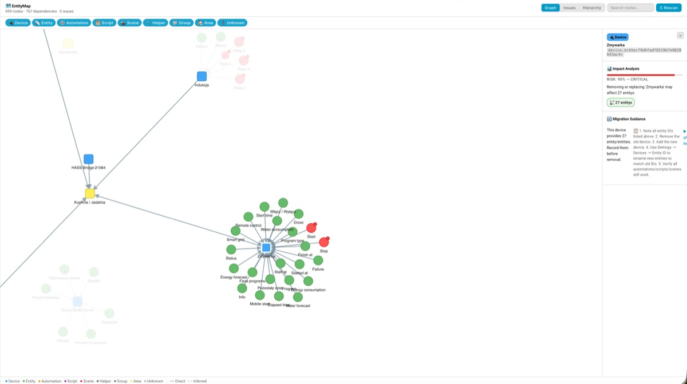
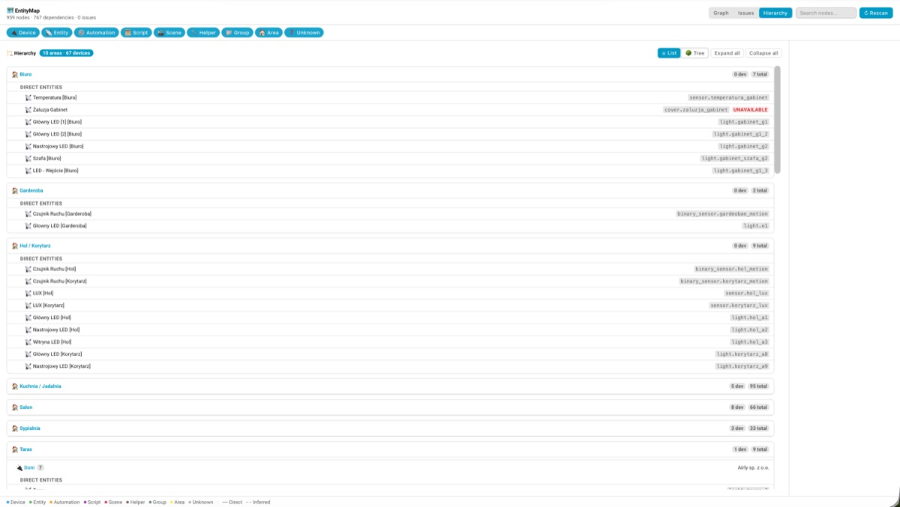
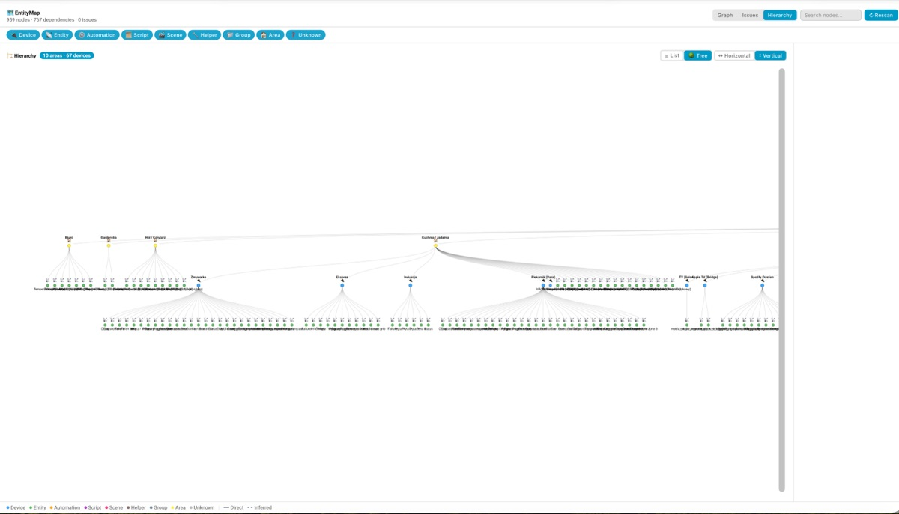
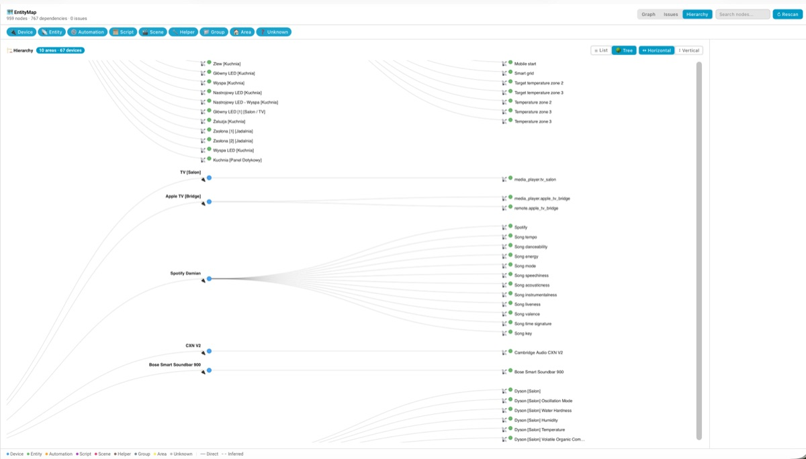
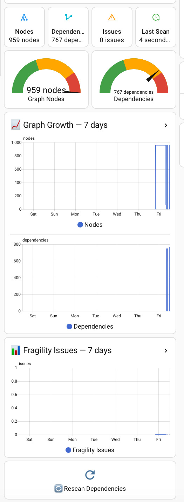

<p align="center">
  
</p>

<p align="center">
  <strong>Dependency Mapping & Impact Analysis for Home Assistant</strong>
</p>

<p align="center">
  <a href="https://github.com/polprog-tech/EntityMap/actions/workflows/ci.yml"></a>
  <a href="https://github.com/polprog-tech/EntityMap/actions/workflows/validate.yml"></a>
  <a href="https://github.com/polprog-tech/EntityMap/releases"></a>
  <a href="https://github.com/polprog-tech/EntityMap/blob/main/LICENSE"></a>
  <a href="https://github.com/polprog-tech/EntityMap/stargazers"></a>
</p>

---

**EntityMap** is a Home Assistant custom integration that answers a simple question: **"What depends on what in my smart home?"**

It scans your entire configuration — devices, entities, automations, scripts, scenes, helpers, groups — and builds a live dependency graph. Then it shows you, visually and interactively, how everything is connected. Before you replace a Zigbee device, disable an entity, or refactor an automation, EntityMap tells you exactly what will break.

- **What depends on this device?** — See every automation, script, and scene that references it
- **Is anything broken right now?** — Find missing entities, stale references, gone devices
- **How risky is this change?** — Risk score from 0-100 with severity classification
- **How do I safely replace this?** — Step-by-step migration guidance
- **Are my automations fragile?** — Detect device_id references, tight coupling, hidden dependencies

Unlike manually searching through YAML files, EntityMap gives you a **complete, interactive dependency graph** with one-click impact analysis — all 100% local, read-only, and instant.

---

## Table of Contents

- [Key Features](#key-features)
- [Screenshots](#screenshots)
- [Installation](#installation)
- [Supported Home Assistant Versions](#supported-home-assistant-versions)
- [Supported Languages](#supported-languages)
- [Configuration Guide](#configuration-guide)
- [Using the Graph Panel](#using-the-graph-panel)
- [Entities Explained](#entities-explained)
- [Services](#services)
- [Ready-Made Dashboard](#ready-made-dashboard)
- [Impact Analysis](#impact-analysis)
- [Fragility Detection](#fragility-detection)
- [Example Use Cases](#example-use-cases)
- [Troubleshooting](#troubleshooting)
- [FAQ](#faq)
- [Limitations & Known Tradeoffs](#limitations--known-tradeoffs)
- [Privacy & Security](#privacy--security)
- [Architecture](#architecture)
- [Development](#development)
- [Contributing](#contributing)
- [License](#license)
- [Changelog](#changelog)

---

## Key Features

- **Interactive dependency graph** — Zoomable, draggable force-directed visualization with color-coded node types
- **Hierarchy view** — Area → Device → Entity tree with list and visual D3 tree modes (horizontal & vertical)
- **Impact analysis** — Select any node to see exactly what breaks if you remove, disable, or replace it
- **Fragility detection** — Automatically find device_id references, missing entities, stale references, tight coupling
- **Migration guidance** — Step-by-step recommendations for safely replacing devices or entities
- **Repair issues** — Actionable warnings surfaced in Home Assistant's Repairs dashboard
- **Three services** — `entitymap.scan`, `entitymap.analyze_impact`, `entitymap.get_dependencies`
- **Summary sensors** — Total nodes, total dependencies, fragility issue count, last scan time
- **WebSocket API** — Full programmatic access for custom dashboards and automations
- **Fully async** — No blocking I/O; uses async adapters for all registry and config access
- **Zero external dependencies** — Uses only libraries bundled with Home Assistant
- **Diagnostics support** — Safe diagnostics output with sensitive data redaction
- **UI configuration** — Config flow and options flow, no YAML needed

## Screenshots

### Dependency Graph

Full interactive force-directed graph — every device, entity, automation, script, and scene as a connected node.

<p align="center">
  
</p>

### Impact Analysis & Detail Panel

Click any node to see risk score, affected entities, and step-by-step migration guidance.

<p align="center">
  
</p>

### Hierarchy — List View

Collapsible list of Areas → Devices → Entities with entity IDs, availability badges, and counts.

<p align="center">
  
</p>

### Hierarchy — Tree View

Visual D3 tree layout (vertical and horizontal) — like a genealogical tree for your smart home.

<p align="center">
  
</p>

<p align="center">
  
</p>

### Dashboard Cards

Ready-made Lovelace cards — status tiles, gauges, history graphs, and a rescan button.

<p align="center">
  
</p>

---

## Installation

### Via HACS (Recommended)

1. Open HACS in Home Assistant
2. Click the three dots menu > **Custom repositories**
3. Add `https://github.com/polprog-tech/EntityMap` as an **Integration**
4. Search for "EntityMap" and install
5. Restart Home Assistant
6. Go to **Settings** > **Devices & Services** > **Add Integration** > search for **EntityMap**

### Manual Installation

1. Download or clone this repository
2. Copy `custom_components/entitymap/` to your Home Assistant `config/custom_components/` directory
3. Restart Home Assistant
4. Go to **Settings** > **Devices & Services** > **Add Integration** > search for **EntityMap**

---

## Supported Home Assistant Versions

**Minimum:** Home Assistant 2025.1.0

---

## Supported Languages

EntityMap is fully translated and adapts to your Home Assistant language setting.

| Language | Code | Status |
|----------|------|--------|
| 🇬🇧 English | `en` | ✅ Complete |
| 🇵🇱 Polish (Polski) | `pl` | ✅ Complete |

All UI elements are translated: config flow, options flow, entity names, error messages, repair issues, and service descriptions.

**Want to add your language?** Copy `custom_components/entitymap/translations/en.json`, translate the values, save as `{language_code}.json`, and open a PR. See [CONTRIBUTING.md](CONTRIBUTING.md) for details.

---

## Configuration Guide

### Step 1: Add the Integration

1. Go to **Settings** > **Devices & Services** > **Add Integration**
2. Search for **EntityMap**
3. You'll see the setup form with default options

### Step 2: Choose Scan Settings

| Setting | Default | What it does |
|---------|---------|--------------|
| **Scan on startup** | ✅ On | Runs a full dependency scan when Home Assistant starts |
| **Auto refresh** | ✅ On | Automatically rescans when device/entity registries change |
| **Scan interval** | 6 hours | How often to run a periodic reconciliation scan |
| **Include templates** | ✅ On | Parse template entity configs for entity references (regex-based) |
| **Include groups** | ✅ On | Include group membership edges in the graph |

> **Tip:** The defaults work well for most installations. Start with them and adjust later if needed.

### Step 3: Wait for First Scan

After adding the integration, EntityMap automatically runs a full scan. This typically takes **under 2 seconds**. Once complete:

- The **EntityMap** panel appears in your sidebar
- Summary sensors are created under the EntityMap device
- Fragility findings (if any) appear in the Repairs dashboard

### Changing Settings After Setup

Go to **Settings** > **Devices & Services** > **EntityMap** > **Configure** to adjust scan interval, toggle template/group scanning, or change auto-refresh behavior.

---

## Using the Graph Panel

EntityMap adds a panel to your Home Assistant sidebar. Here's what you can do:

### Graph View (default)

- **Pan and zoom** — Scroll to zoom, drag the background to pan
- **Drag nodes** — Click and drag any node to rearrange the layout
- **Click a node** — Opens the detail panel with impact analysis, fragility findings, and migration guidance
- **Filter by type** — Use the chips at the top to show/hide specific node types (devices, entities, automations, etc.)
- **Search** — Type in the search box to filter nodes by name or ID; neighbors of matched nodes are shown too

### Issues View

- Switch to the **Issues** tab to see all fragility findings as a card grid
- Cards are color-coded by severity (critical, high, medium, low, info)
- Click any card to jump to the affected node in the graph view

### Hierarchy View

- Switch to the **Hierarchy** tab to browse your setup organized by Area → Device → Entity
- **List mode** — Collapsible sections per area with device/entity counts, entity IDs, and availability badges; expand/collapse all with one click
- **Tree mode** — Visual D3 tree layout; toggle between **↔ Horizontal** and **↕ Vertical** orientation; zoom, pan, and click any node to jump to the graph view

### Detail Panel

When you click a node, the right panel shows:

- **Node identity** — Type badge, name, entity ID, availability status
- **Impact analysis** — Risk meter (0-100%), severity, affected entity counts by type
- **Fragility findings** — Issues specific to this node with severity and remediation
- **Migration guidance** — Step-by-step recommendations if you're planning to replace or remove this entity/device

---

## Entities Explained

EntityMap creates a single device called **EntityMap** with the following entities:

### Summary Sensors (enabled by default)

| Entity | Type | What it shows |
|--------|------|---------------|
| **Total nodes** | Sensor | Number of nodes in the dependency graph (devices, entities, automations, etc.) |
| **Total edges** | Sensor | Number of dependency relationships discovered |
| **Fragility issues** | Sensor | Number of fragility findings across the entire graph. 0 = clean |
| **Last scan** | Sensor | Timestamp of the most recent completed scan |

### Actions

| Entity | What it does |
|--------|--------------|
| **Rescan** | Button entity that triggers an immediate full dependency scan. Use after making configuration changes to get fresh results without waiting for the next scheduled scan. |

### Entity IDs

| Entity | Entity ID |
|--------|-----------|
| Total nodes | `sensor.entitymap_total_nodes` |
| Total edges | `sensor.entitymap_total_edges` |
| Fragility issues | `sensor.entitymap_fragility_issues` |
| Last scan | `sensor.entitymap_last_scan` |
| Rescan | `button.entitymap_rescan` |

Entity IDs are set via `suggested_object_id` in the code and are always English regardless of your Home Assistant language setting. The language setting only affects display names shown in the UI — the underlying entity IDs remain stable.

---

## Services

### `entitymap.scan`

Trigger a full dependency scan. Returns node and edge counts.

```yaml
service: entitymap.scan
```

### `entitymap.analyze_impact`

Analyze what would break if a specific node were removed, disabled, or replaced.

```yaml
service: entitymap.analyze_impact
data:
  node_id: "light.living_room"
```

Returns: risk score, severity, affected entities by type, fragility findings, migration suggestions.

### `entitymap.get_dependencies`

Get inbound and outbound dependencies for a specific node.

```yaml
service: entitymap.get_dependencies
data:
  node_id: "automation.motion_light"
  include_inferred: true
```

Returns: lists of nodes that this entity depends on, and nodes that depend on it.

---

## Impact Analysis

When you select a node in the graph (or call `entitymap.analyze_impact`), EntityMap:

1. **Finds direct dependents** — objects that explicitly reference the target
2. **Traces transitive dependents** — the full chain of objects affected downstream
3. **Calculates a risk score** (0-100) based on dependent count, object types, and reference fragility
4. **Assigns severity** — Critical (≥70), High (≥50), Medium (≥25), Low (>0), Info (0)
5. **Generates migration suggestions** based on the types of dependencies found

### Risk Score Examples

| Scenario | Risk | Severity |
|----------|------|----------|
| Light with no dependents | 0% | Info |
| Entity used in 1 automation | ~15% | Low |
| Device used in 5 automations + 2 scripts | ~65% | High |
| Core entity with 10+ transitive dependents | ~85% | Critical |

---

## Fragility Detection

EntityMap automatically detects these fragility patterns on every scan:

| Finding | Severity | What it means |
|---------|----------|---------------|
| **Missing entity reference** | High | An automation references an entity that doesn't exist in the registry |
| **Missing device reference** | High | An automation references a device that's been removed |
| **Device ID reference** | Medium | Using `device_id`-based triggers — fragile to device re-pairing |
| **Disabled reference** | Low | Referencing a disabled entity (may be intentional) |
| **Tight device coupling** | High | 3+ `device_id` references to the same device in one automation |
| **Hidden dependency** | Info | An automation calls a script that has many sub-dependencies of its own |

Findings appear in three places:
1. The **Issues** tab in the EntityMap panel
2. The **detail panel** when you click an affected node
3. The Home Assistant **Repairs** dashboard (for high/critical findings)

---

## Example Use Cases

### Before Replacing a Zigbee Device

1. Open the EntityMap panel from the sidebar
2. Search for your device name
3. Click the device node
4. Review the impact panel — see every automation, script, and scene affected
5. Follow the migration guidance checklist

### Finding Broken References After a Cleanup

1. Switch to the **Issues** tab in the EntityMap panel
2. Review findings sorted by severity
3. Click a finding to jump to the affected node in the graph
4. Fix the broken reference in the automation/script editor

### Reviewing Fragile device_id Usage

1. Check the **Repairs** dashboard for EntityMap warnings
2. Or use the Issues tab to find all `device_id_reference` findings
3. Consider switching to entity-based triggers for resilience against re-pairing

### Pre-Migration Audit

Before a major HA update or device ecosystem change:

```yaml
# Run a scan and check the fragility sensor
service: entitymap.scan
```

Then review `sensor.entitymap_fragility_issues` — if it's > 0, open the panel and address findings before proceeding.

---

## Ready-Made Dashboard

EntityMap comes with ready-to-use cards — you can set up a full dashboard or add individual cards to any existing dashboard.

### How to add a card (3 steps)

This works for **any** card below:

1. Open any dashboard → click the **pencil ✏️** icon (top right) to enter Edit mode
2. Click **"+ Add Card"** (bottom right) → scroll down → click **"Manual"**
3. Paste the YAML → click **"Save"**

That's it! The card appears on your dashboard immediately.

> **Tip:** Entity IDs used in the examples below match what the integration creates. If you renamed an entity manually, go to **Settings** > **Devices & Services** > **Entities** and search "entitymap" to verify.

### 🟢 Option A: All-in-One Card

One card with everything — status tiles, gauges, history charts, and rescan button. Perfect for adding to your main dashboard.

Paste the contents of [`docs/cards/all-in-one.yaml`](docs/cards/all-in-one.yaml):

```yaml
type: vertical-stack
cards:
  - type: grid
    columns: 4
    square: false
    cards:
      - type: tile
        entity: sensor.entitymap_total_nodes
        name: Nodes
        icon: mdi:graph
        color: blue
        vertical: true
      - type: tile
        entity: sensor.entitymap_total_edges
        name: Dependencies
        icon: mdi:vector-polyline
        color: cyan
        vertical: true
      - type: tile
        entity: sensor.entitymap_fragility_issues
        name: Issues
        icon: mdi:alert-outline
        color: orange
        vertical: true
      - type: tile
        entity: sensor.entitymap_last_scan
        name: Last Scan
        icon: mdi:clock-check-outline
        color: green
        vertical: true
  - type: grid
    columns: 2
    square: false
    cards:
      - type: gauge
        entity: sensor.entitymap_total_nodes
        name: "Graph Nodes"
        min: 0
        max: 500
        needle: true
        severity:
          green: 0
          yellow: 200
          red: 400
      - type: gauge
        entity: sensor.entitymap_total_edges
        name: "Dependencies"
        min: 0
        max: 1000
        needle: true
        severity:
          green: 0
          yellow: 400
          red: 800
  - type: history-graph
    title: "📈 Graph Growth — 7 days"
    hours_to_show: 168
    entities:
      - entity: sensor.entitymap_total_nodes
        name: Nodes
      - entity: sensor.entitymap_total_edges
        name: Dependencies
  - type: history-graph
    title: "📊 Fragility Issues — 7 days"
    hours_to_show: 168
    entities:
      - entity: sensor.entitymap_fragility_issues
        name: Fragility Issues
  - type: button
    entity: button.entitymap_rescan
    name: "🔄 Rescan Dependencies"
    icon: mdi:refresh
    tap_action:
      action: toggle
    show_state: false
    icon_height: 40px
```

### 🧩 Option B: Individual Cards

Pick only the cards you need. Each file in [`docs/cards/`](docs/cards/) is a standalone card.

| Card | What it shows | File |
|------|---------------|------|
| **Status Overview** | 4 colored tiles: Nodes, Dependencies, Issues, Last Scan | [`status-overview.yaml`](docs/cards/status-overview.yaml) |
| **Graph Stats Gauges** | Two needle gauges for nodes and dependencies | [`graph-stats-gauges.yaml`](docs/cards/graph-stats-gauges.yaml) |
| **Graph Growth Chart** | 7-day history graph of nodes + dependencies | [`graph-growth.yaml`](docs/cards/graph-growth.yaml) |
| **Fragility History** | 7-day history graph of fragility issue count | [`fragility-history.yaml`](docs/cards/fragility-history.yaml) |
| **Actions & Fragility** | Rescan button + fragility summary | [`actions-fragility.yaml`](docs/cards/actions-fragility.yaml) |
| **All-in-One** | Everything in a single card | [`all-in-one.yaml`](docs/cards/all-in-one.yaml) |

### 📋 Option C: Full Dedicated Dashboard

If you want a separate "Dependency Health" dashboard with all cards pre-arranged:

1. Go to **Settings** > **Dashboards** > **Add Dashboard**
2. Name it "Dependency Health" and create it
3. Open the new dashboard → **three-dot menu** (⋮) → **Edit Dashboard**
4. **Three-dot menu** (⋮) again → **Raw configuration editor**
5. Paste the contents of [`docs/dashboard.yaml`](docs/dashboard.yaml)
6. Click **Save**

---

## Troubleshooting

| Problem | Solution |
|---------|----------|
| **Graph is empty** | Click the **Rescan** button or call `entitymap.scan`. First scan runs automatically on startup. |
| **Missing automations in the graph** | Ensure automations are loaded before EntityMap starts (check `after_dependencies` in manifest). Restart HA if needed. |
| **Panel not showing in sidebar** | Clear browser cache. Check HA logs for frontend registration errors. |
| **"Scan failed" repair issue** | Check HA logs for adapter errors. One of the source adapters may have hit an unexpected data format. File an issue with diagnostics. |
| **Entities show `unknown`** | This is normal right after a restart — values populate after the first scan completes (usually within seconds). |
| **Entity IDs don't match the docs** | If you previously installed EntityMap before `suggested_object_id` was added, remove and re-add the integration to get the correct English entity IDs. |

### Checking Logs

If something isn't working, check Home Assistant logs:

1. Go to **Settings** > **System** > **Logs**
2. Search for `entitymap`
3. Look for ERROR or WARNING messages

You can also enable debug logging by adding this to `configuration.yaml`:

```yaml
logger:
  logs:
    custom_components.entitymap: debug
```

---

## FAQ

<details>
<summary><strong>Does EntityMap modify my automations or scripts?</strong></summary>

No. EntityMap is **completely read-only**. It only reads configuration data from HA registries and component stores. It never writes, modifies, or deletes anything in your setup. It's safe to install alongside any other integration.
</details>

<details>
<summary><strong>How accurate is the template reference extraction?</strong></summary>

EntityMap uses regex-based pattern matching to extract entity references from Jinja2 templates. This covers the common patterns — `states('entity_id')`, `is_state()`, `state_attr()`, and direct `states.domain.entity` references.

Complex templates using `set` variables, macros, or dynamically constructed entity IDs may be missed. EntityMap marks these references as **inferred** (medium confidence) in the graph so you can distinguish them from direct references.

Coverage is approximately **85%** of real-world template usage. Full Jinja2 AST parsing is planned for a future release.
</details>

<details>
<summary><strong>How often should I scan?</strong></summary>

The default 6-hour periodic scan works well for most users. EntityMap also listens for registry change events and rescans automatically when devices or entities are added, removed, or modified.

You only need manual rescans after editing automation/script YAML — those changes don't trigger registry events.
</details>

<details>
<summary><strong>What happens with very large installations (1000+ entities)?</strong></summary>

The backend scan is fast — typically under 2 seconds even for large installations. The visual graph clips at **500 nodes** for D3.js performance. Use the search and filter features to navigate large graphs.

If you have 5000+ entities, scans may take 3-5 seconds. The graph will show the first 500 nodes; use type filters to focus on the nodes you care about.
</details>

<details>
<summary><strong>Can I use EntityMap data in my own automations?</strong></summary>

Yes! You have several options:

1. **Sensors** — Use `sensor.entitymap_fragility_issues` to trigger automations when new issues appear
2. **Services** — Call `entitymap.analyze_impact` or `entitymap.get_dependencies` from scripts
3. **WebSocket API** — For advanced use, the same WebSocket commands used by the panel are available to any WS client

Example automation that alerts when fragility issues increase:

```yaml
automation:
  - alias: "EntityMap - New Fragility Issues"
    trigger:
      - platform: numeric_state
        entity_id: sensor.entitymap_fragility_issues
        above: 0
    action:
      - service: notify.mobile_app
        data:
          title: "EntityMap Alert"
          message: "{{ states('sensor.entitymap_fragility_issues') }} fragility issues detected."
```
</details>

<details>
<summary><strong>Does EntityMap require internet access?</strong></summary>

The backend is **100% local** — no internet required. However, the graph panel loads **D3.js from a CDN** on first use. If your HA instance has no internet access, the graph visualization won't render.

Bundling D3.js locally is planned for a future release to support fully air-gapped installations.
</details>

<details>
<summary><strong>What is <code>__pycache__</code> and how do I delete it?</strong></summary>

Python caches compiled `.pyc` files in `__pycache__` folders. After updating EntityMap, **stale cached bytecode** can cause errors. Deleting `__pycache__` forces Python to recompile from updated source.

**Terminal / SSH:**
```bash
find /config/custom_components/entitymap -type d -name __pycache__ -exec rm -rf {} +
```
> On HA Container or Core, replace `/config` with your config path (e.g., `~/.homeassistant`).

**macOS Finder:** Press **⌘ Cmd + Shift + .** to toggle hidden files, then delete `__pycache__`.

**Windows Explorer:** Click **View** > **Hidden items**, then delete the folder.
</details>

<details>
<summary><strong>How do I completely uninstall EntityMap?</strong></summary>

1. Go to **Settings** > **Devices & Services** > **EntityMap**
2. Click the three dots (⋮) > **Delete**
3. Restart Home Assistant
4. Delete the `custom_components/entitymap/` directory
5. (Optional) Remove the EntityMap panel entry from your sidebar
6. Restart Home Assistant once more

If installed via HACS, use HACS to remove it instead of manually deleting files.
</details>

---

## Limitations & Known Tradeoffs

- **Template extraction is regex-based** — Complex Jinja2 templates with macros, `set` variables, or dynamic entity IDs may be missed. EntityMap marks extracted references as "inferred" confidence.
- **Automation configs accessed via HA APIs** — EntityMap reads automation configurations through HA component APIs, not raw YAML files. If HA changes these internal APIs, adapters may need updating.
- **Entity availability is a point-in-time snapshot** — The `available` flag reflects status at scan time, not real-time.
- **Graph clips at 500 nodes** — For browser performance. Use search and filters on large installations.
- **D3.js loaded from CDN** — Requires internet on first panel load. Offline bundling is planned.
- **Single config entry** — Only one EntityMap instance per HA installation.

---

## Privacy & Security

- **All processing is local** — No data is sent to external services
- **No telemetry** — EntityMap does not collect or transmit usage data
- **Read-only** — EntityMap never modifies your automations, scripts, scenes, or any configuration
- **Diagnostics are redacted** — Entity IDs are anonymized in diagnostics downloads
- **Network activity** — Only the frontend panel loads D3.js from `cdn.jsdelivr.net` on first use

---

## Architecture

EntityMap uses a **hybrid event-driven + on-demand** architecture:

- **Full scan on startup** (configurable) builds the complete dependency graph in memory
- **Registry event listeners** trigger automatic rebuilds when devices/entities change
- **Periodic reconciliation** scans ensure the graph stays fresh over time
- **On-demand rescan** via button entity, service call, or panel button

This approach avoids the overhead of DataUpdateCoordinator (not suitable for local graph computation) while remaining responsive to changes.

### What Objects Are Analyzed

| Object Type | Coverage | Source |
|-------------|----------|--------|
| Devices | ✅ Full | Device registry |
| Entities | ✅ Full | Entity registry + state machine |
| Automations | ✅ Full | Automation component configs |
| Scripts | ✅ Full | Script component configs |
| Scenes | ✅ Full | Scene component configs |
| Helpers | ✅ Full | Entity registry (input_* domains) |
| Groups | ✅ Full | Group state attributes |
| Templates | ⚡ Partial | Template entity configs (regex-based) |
| Areas | ✅ Reference | Area registry |

### Direct vs Inferred Dependencies

- **Direct** (high confidence) — Entity explicitly referenced by ID in a trigger, condition, action, or target
- **Inferred** (medium confidence) — Entity reference extracted from a Jinja2 template via regex
- **Low confidence** — Heuristic matches that may have false positives

---

## Development

### Setup

```bash
git clone https://github.com/polprog-tech/EntityMap.git
cd EntityMap
python -m venv venv
source venv/bin/activate
pip install homeassistant voluptuous aiohttp pytest pytest-asyncio pytest-cov ruff mypy
```

### Running Tests

```bash
pytest tests/ -v --cov=custom_components/entitymap
```

### Test Report

All tests follow the **GIVEN / WHEN / THEN** convention.

| Module | Tests | Status |
|---|---|---|
| **Analysis** — impact analysis engine | 11 | ✅ |
| **Config Flow** — UI setup & options | 6 | ✅ |
| **Diagnostics** — diagnostics export | 4 | ✅ |
| **Fragility** — fragility detection | 14 | ✅ |
| **Graph** — graph builder lifecycle | 6 | ✅ |
| **Migration** — migration suggestions | 9 | ✅ |
| **Models** — domain models & serialization | 33 | ✅ |
| **Total** | **83** | **✅ All passing** |

<details>
<summary>Full test breakdown by scenario class</summary>

**Analysis** (`test_analysis.py`)
- `TestImpactOnNonexistentNode` — 2 tests
- `TestImpactOnEntityWithDependents` — 3 tests
- `TestImpactOnDevice` — 2 tests
- `TestImpactOnHelper` — 1 test
- `TestImpactOnIsolatedNode` — 2 tests
- `TestImpactRiskScoring` — 1 test

**Config Flow** (`test_config_flow.py`)
- `TestConfigFlowUserStep` — 3 tests
- `TestOptionsFlowInit` — 3 tests

**Diagnostics** (`test_diagnostics.py`)
- `TestDiagnosticsOutput` — 2 tests
- `TestDiagnosticsPrivacy` — 1 test
- `TestDiagnosticsWithFindings` — 1 test

**Fragility** (`test_fragility.py`)
- `TestCleanGraph` — 2 tests
- `TestMissingEntityReference` — 2 tests
- `TestMissingDeviceReference` — 1 test
- `TestDeviceIdUsage` — 2 tests
- `TestDisabledReference` — 2 tests
- `TestTightDeviceCoupling` — 2 tests
- `TestHiddenDependency` — 2 tests
- `TestFindingIdStability` — 1 test

**Graph** (`test_graph.py`)
- `TestGraphBuilderInitialState` — 2 tests
- `TestGraphBuilderBuild` — 2 tests
- `TestGraphBuilderSerialization` — 2 tests

**Migration** (`test_migration.py`)
- `TestMigrationForNonexistentNode` — 1 test
- `TestMigrationForIsolatedNode` — 1 test
- `TestMigrationForTriggerDependency` — 2 tests
- `TestMigrationForDeviceReplacement` — 2 tests
- `TestMigrationForSceneMembers` — 1 test
- `TestMigrationForGroupMembers` — 1 test
- `TestMigrationForMultipleDependencies` — 1 test

**Models** (`test_models.py`)
- `TestGraphNodeCreation` — 3 tests
- `TestGraphNodeSerialization` — 2 tests
- `TestGraphNodeImmutability` — 2 tests
- `TestGraphEdgeCreation` — 2 tests
- `TestGraphEdgeSerialization` — 1 test
- `TestGraphNodeOperations` — 3 tests
- `TestGraphEdgeOperations` — 4 tests
- `TestGraphDependencyQueries` — 3 tests
- `TestGraphTransitiveTraversal` — 2 tests
- `TestGraphNeighborhood` — 3 tests
- `TestGraphLifecycle` — 2 tests
- `TestFragilityFindingSerialization` — 2 tests
- `TestImpactReportSerialization` — 2 tests
- `TestMigrationSuggestionSerialization` — 2 tests

</details>

### Linting

```bash
ruff check .
ruff format --check .
```

### Type Checking

```bash
mypy custom_components/entitymap --ignore-missing-imports
```

---

## Contributing

See [CONTRIBUTING.md](CONTRIBUTING.md) for development setup, architecture guidelines, and testing philosophy.

---

## License

MIT License — see [LICENSE](LICENSE).

---

## Changelog

See [CHANGELOG.md](CHANGELOG.md).